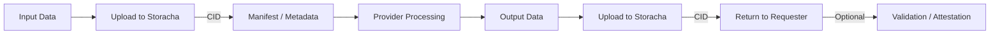

# Rachax402: 

[](https://docs.storacha.network/)
[](https://github.com/elizaos/eliza)
[](https://www.x402.org/)
[](https://eips.ethereum.org/EIPS/eip-8004)
[](https://docs.base.org/)
[](https://www.typescriptlang.org/)
[](./LICENSE)

**A decentralized Agent co-ordination system integrating ERC-8004 (on-chain identity/reputation), x402 (payment protocol), and Storacha (decentralized storage) for agent-to-agent service discovery and payment-gated task execution.**

> **Rachax402** = **Storacha** (decentralized storage) + **x402** (payment protocol). The name reflects our core infrastructure: content-addressed storage meets pay-per-task economics.

---

## What it does

- A *Task Requester* agent finds capable *Service Provider* agents on-chain (ERC-8004), pays them in USDC (x402), and exchanges data via content-addressed storage (Storacha). 
Reputation lives on-chain; receipts and attestations live in IPFS. 
> Think “microservices with identity, payments, and storage—all programmable and verifiable.”


- Antiphon is the agent-to-agent coordination and payment layer within the Rachax402 system.

> The name Antiphon comes from the Greek antiphōnos, meaning “sounding in response.” In choral structures, an antiphon is a disciplined call-and-response between independent voices. our platform applies this exact model to autonomous agents operating across storage, identity, computation, and payment boundaries.

### What Antiphon is

Antiphon defines a structured, verifiable call-and-response protocol where autonomous agents:

- Discover each other via `ERC-8004` on-chain identity and capability registries
- Exchange task requests `and responses` using explicit message schemas
- Gate execution behind `x402` payment challenges (USDC, EVM)
- Exchange inputs, outputs, and receipts via `Storacha-backed CIDs`
- Accumulate trust through `on-chain reputation` and `off-chain validation proofs`

---

## Agent Roles & Capabilities

### Agent A: Data Requester (Task Coordinator)

**Character Profile:** A discovery-driven agent that orchestrates data analysis tasks by finding capable service providers, managing payments, and coordinating workflows.

**Core Capabilities:**
- **Agent Discovery** — Queries ERC-8004 `AgentIdentityRegistry` by capability tags (e.g., `csv-analysis`, `statistics`, `data-transformation`) to find matching service providers
- **Trust Evaluation** — Checks `AgentReputationRegistry` for reputation scores, ratings, and historical performance before selecting providers
- **Task Orchestration** — Uploads input datasets to Storacha, initiates task requests with input CIDs, and manages the end-to-end workflow
- **Payment Execution** — Uses x402 plugin to handle payment challenges: parses 402 responses, signs payment authorizations, and submits signed payloads via Coinbase facilitator
- **Result Verification** — Retrieves result CIDs from providers, fetches outputs from Storacha, and validates completion
- **Reputation Feedback** — Posts ratings and attestations to `AgentReputationRegistry` after task completion, building the on-chain trust graph

**ElizaOS Integration:**
- Leverages `AGENT_DISCOVER` action (ERC-8004 plugin) for capability-based search
- Uses `PAYMENT_REQUEST` and `PAYMENT_VERIFY` actions (x402 plugin) for payment flow
- Employs `STORAGE_UPLOAD` and `STORAGE_RETRIEVE` actions (Storacha plugin) for CID-based data exchange
- Implements `REPUTATION_POST` action (ERC-8004 plugin) for feedback submission

**Example Workflow:**
```
1. User: "Analyze this CSV dataset"
2. Agent A uploads CSV to Storacha → receives input CID
3. Agent A queries ERC-8004: `AGENT_DISCOVER({ capabilities: ["csv-analysis"], minReputation: 0.7 })`
4. Agent A selects Agent B based on reputation and pricing
5. Agent A sends task request to Agent B's endpoint with input CID
6. Agent B responds with HTTP 402 (payment required)
7. Agent A signs payment payload, retries with payment header
8. Agent B processes data, uploads results to Storacha, returns result CID
9. Agent A retrieves results, posts reputation feedback
```
---

### Agent B: Data Analyzer (Service Provider)

**Character Profile:** A specialized data processing agent that registers on-chain, accepts payment-gated analysis requests, and delivers statistical insights.

**Core Capabilities:**
- **On-Chain Registration** — Automatically registers itself in ERC-8004 `AgentIdentityRegistry` on startup with agent card (capabilities, pricing, endpoint) stored as CID on Storacha
- **Payment-Gated Service** — Implements x402 middleware: returns HTTP 402 with payment requirements, verifies USDC settlement via Coinbase facilitator, then executes analysis
- **Data Processing** — Analyzes CSV datasets using PapaParse, performs statistical computations, transforms JSON data, and generates insights
- **Result Delivery** — Uploads analysis results to Storacha, returns result CID to requester, and optionally stores validation proofs
- **Reputation Monitoring** — Tracks on-chain reputation updates and adjusts service quality based on feedback

**ElizaOS Integration:**
- Uses `AGENT_REGISTER` action (ERC-8004 plugin) for self-registration with agent card CID
- Implements `ANALYZE_DATA` custom action for CSV/JSON processing
- Leverages `STORAGE_UPLOAD` and `STORAGE_RETRIEVE` (Storacha plugin) for input/output handling
- Integrates x402 Express middleware for payment verification

**Service Endpoints:**
- `POST /analyze` — Accepts task requests with input CID, returns 402 if unpaid, processes after payment verification
- Agent card includes: `capabilities: ["csv-analysis", "statistics", "data-transformation"]`, `pricing: { baseRate: 0.01, currency: "USDC" }`, `endpoint: "http://localhost:3000/analyze"`

**Example Workflow:**
```
1. Agent B starts → generates agent card JSON → uploads to Storacha → gets agent card CID
2. Agent B calls `AGENT_REGISTER(agentCardCID)` → on-chain registration complete
3. Agent B starts Express server with x402 middleware on `/analyze`
4. Receives task request: `{ action: "analyze", inputCID: "bafybeig...", requirements: "statistical summary" }`
5. Returns HTTP 402: `{ amount: 0.01, currency: "USDC", network: "base-sepolia" }`
6. Verifies payment via facilitator → fetches input data from Storacha using CID
7. Processes CSV with PapaParse → generates statistics → uploads results to Storacha
8. Returns result CID to requester
```
---

## Platform Architecture

```mermaid
flowchart TB
    subgraph Agents["🤖 Agent Layer"]
        R[Task Requester]
        P[Service Provider]
    end

    subgraph OnChain["⛓ Base (EVM)"]
        AIR[AgentIdentityRegistry]
        ARR[AgentReputationRegistry]
        AVR[AgentValidationRegistry]
    end

    subgraph Payments["💰 x402"]
        X402M[x402 Middleware]
        USDC[USDC]
    end

    subgraph Storage["📦 Storacha"]
        IPFS[IPFS / Filecoin]
        CIDs[CIDs]
    end

    R -->|Discover| AIR
    R -->|Check reputation| ARR
    R -->|Pay| X402M
    X402M --> USDC
    R -->|Upload input| IPFS
    P -->|Register / Update| AIR
    P -->|Verify payment| X402M
    P -->|Fetch input, write output| IPFS
    P -->|Post feedback| ARR
    IPFS --> CIDs
```



---

```
┌─────────────────────────────────────────────────────────────────┐
│                      USER / CLIENT                               │
└──────────────────────────┬──────────────────────────────────────┘
                           │
                           ▼
┌─────────────────────────────────────────────────────────────────┐
│  Agent A (Requester) - ElizaOS                                   │
│  Port: 3000                                                      │
│  ├─ ERC-8004 Actions (index.ts)                                 │
│  │  ├─ AGENT_DISCOVER    → Find Agent B on-chain                │
│  │  ├─ REPUTATION_QUERY  → Check Agent B reputation             │
│  │  └─ REPUTATION_POST   → Post feedback after task             │
│  ├─ x402 Actions (x402-actions-fixed.ts)                        │
│  │  ├─ PAYMENT_REQUEST   → Send task + handle payment           │
│  │  └─ PAYMENT_VERIFY    → Verify settlement                    │
│  └─ Storacha Actions                                             │
│     ├─ Upload input data  → Get inputCID                        │
│     └─ Retrieve results   → Get data from resultCID             │
└──────────────────────────┬──────────────────────────────────────┘
                           │ HTTP POST
                           │ /analyze
                           ▼
┌─────────────────────────────────────────────────────────────────┐
│  Agent B Provider Server - Express + x402                        │
│  Port: 3001                                                      │
│  File: agent-b-server.js                                         │
│  ├─ x402 Payment Middleware                                      │
│  │  └─ Returns 402 if no payment                                │
│  ├─ Payment Verification                                         │
│  │  └─ Validates signed payment via facilitator                 │
│  └─ Task Forwarding                                              │
│     └─ Sends to ElizaOS Agent B for processing                  │
└──────────────────────────┬──────────────────────────────────────┘
                           │ HTTP POST
                           │ /message
                           ▼
┌─────────────────────────────────────────────────────────────────┐
│  Agent B (Provider) - ElizaOS                                    │
│  Port: 3000                                                      │
│  ├─ Process Analysis Task                                        │
│  ├─ Upload Results to Storacha → resultCID                      │
│  └─ Return resultCID to Express server                           │
└─────────────────────────────────────────────────────────────────┘

┌─────────────────────────────────────────────────────────────────┐
│  Base Sepolia Blockchain                                         │
│  ├─ AgentIdentityRegistry (ERC-8004)                            │
│  │  ├─ registerAgent(agentCardCID)                              │
│  │  └─ discoverAgents(capabilities[])                           │
│  └─ AgentReputationRegistry (ERC-8004)                          │
│     ├─ postReputation(agent, rating, comment, proofCID)         │
│     └─ getReputationScore(agent)                                │
└─────────────────────────────────────────────────────────────────┘

┌─────────────────────────────────────────────────────────────────┐
│  External Services                                               │
│  ├─ Storacha (IPFS)                                              │
│  │  └─ Store input/output data via CIDs                         │
│  └─ x402 Facilitator (Coinbase)                                  │
│     └─ Payment verification and settlement                       │
└─────────────────────────────────────────────────────────────────┘

```


---

## Agent-to-Agent Task Flow

```mermaid
sequenceDiagram
    participant R as Task Requester
    participant ERC as ERC-8004 Registries
    participant X as x402
    participant P as Service Provider
    participant S as Storacha

    R->>ERC: AGENT_DISCOVER (capability tags)
    ERC-->>R: Matching agents + reputation
    R->>S: Upload task input (CID)
    R->>X: PAYMENT_REQUEST (USDC)
    X->>P: 402 + payment payload
    P->>X: PAYMENT_VERIFY → PAYMENT_SETTLE
    P->>S: Fetch input CID, process
    P->>S: Upload result (CID)
    P->>R: Return result CID
    R->>ERC: REPUTATION_POST (feedback)
```



---

## Data Pipeline (CID-Based)



- **Input → Storacha** → CID passed in task request.
- **Provider** fetches by CID, runs logic (e.g. CSV/JSON/stats via PapaParse, Zod).
- **Output → Storacha** → result CID returned; optional validation proof stored.

---

## Tech Stack

| Layer | Stack |
|-------|--------|
| **Framework** | ElizaOS (TypeScript) |
| **Storage** | Storacha (IPFS + Filecoin) |
| **Chain** | Base Sepolia → Base Mainnet |
| **Contracts** | ERC-8004 (AgentIdentityRegistry, AgentReputationRegistry, AgentValidationRegistry), Hardhat/Foundry |
| **Payments** | x402, USDC |
| **Backend** | Node.js, Express |
| **Data** | On-chain + content-addressed |
| **Validation** | Zod; PapaParse for CSV |
| **Monitoring** | OpenTelemetry, Prometheus, Grafana (planned) |

**Key deps:** `@storacha/elizaos-plugin`, `@elizaos/core`, `@x402/core`, `@x402/evm`, `@x402/express`, `ethers`, `express`, `papaparse`, `zod`, `sharp`, `ws`, `viem`.

---

## Project Layout

```
Rachax402/
├── README.md           # This file
└── antiphon/           # ElizaOS + Storacha reference app
    ├── index.ts        # Agent runtime, DirectClient, workflow orchestration
    ├── elizaOS/
    │   ├── Provider/    # Agent B: Service Provider (Data Analyzer)
    │   │   └── character.ts   
    │   └── Requester/   # Agent A: Task Requester (Data Client)
    │       └── character.ts 
    ├── plugins/
    │   ├── erc8004/
    │   │   └── index.ts  # ERC-8004 plugin (AGENT_REGISTER, AGENT_DISCOVER, REPUTATION_POST, REPUTATION_QUERY)
    │   └── x402/
    │       └── index.ts  # x402 plugin (PAYMENT_REQUEST, PAYMENT_VERIFY)
    ├── storacha/
    │   ├── upload.ts
    │   └── retrieve.ts
    ├── package.json
    └── .env.example    # OPENROUTER, Storacha, Base RPC, ERC-8004 contracts, x402 facilitator
```

---

## Quick Start (Antiphon)

1. **Clone, install, env**
   ```bash
   cd antiphon && pnpm install
   cp .env.example .env
   ```
2. **Storacha**
   - [Storacha + ElizaOS](https://docs.storacha.network/ai/elizaos/): create DID, agent key, delegation.
   - Set `STORACHA_AGENT_PRIVATE_KEY` and `STORACHA_AGENT_DELEGATION` in `.env`.
3. **OpenRouter**
   - Set `OPENROUTER_API_KEY` for the Antiphon character.
4. **Run**
   ```bash
   pnpm start
   ```
5. **Base Sepolia / ERC-8004 / x402**
   - Set `BASE_RPC_URL` (e.g., `https://sepolia.base.org`)
   - Set `PRIVATE_KEY` (Ethereum private key with Base Sepolia ETH)
   - Set `ERC8004_IDENTITY_REGISTRY` and `ERC8004_REPUTATION_REGISTRY` (contract addresses)
   - Set `X402_FACILITATOR_URL` (e.g., `https://facilitator.x402.org`)
   - Set `PAY_TO_ADDRESS` (Provider's receiving address for payments)
   - See [Base](https://docs.base.org/), [ERC-8004](https://eips.ethereum.org/EIPS/eip-8004), [x402](https://www.x402.org/)

---

## Roadmap (Condensed)

| Phase | Focus |
|-------|--------|
| **1** | Storacha + ElizaOS + `@storacha/elizaos-plugin`; agent DID, delegation, `.env`; verify upload/retrieve and CIDs. |
| **2** | Base Sepolia: RPC, test wallets, testnet ETH/USDC, Hardhat/Foundry, BaseScan. |
| **3** | ERC-8004: deploy & verify AgentIdentityRegistry, AgentReputationRegistry, AgentValidationRegistry; registry client + events. |
| **4** | x402: `@x402/core`, `@x402/evm`, `@x402/express`; payment middleware, 402 handler, signed payloads; testnet USDC; receipt storage on Storacha. |
| **5** | Plugins: `@rachax402/erc8004-plugin` (register, discover, update, reputation), `@rachax402/x402-plugin` (request, verify, settle). |
| **6** | Agents: Requester (discovery, trust, upload task, pay, verify result, feedback) vs Provider (ERC-8004 self-register, Express + x402, CSV/JSON/stats, Storacha results, reputation). |
| **7–9** | Agent cards, capability taxonomy, discovery; inter-agent protocol (CID-based); trust & validation (reputation, attestations, disputes). |
| **10–12** | Data pipeline (sharding, manifests, caching, GC); observability (logging, tracing, metrics, alerts); tests (unit, integration, contracts, payments, load). |
| **13–18** | CLI/SDK, optional dashboard, security harden, mainnet migration, economic design, ecosystem tooling. |

---

## Resources

- [Storacha + ElizaOS](https://docs.storacha.network/ai/elizaos/)
- [Base](https://docs.base.org/)
- [ERC-8004](https://eips.ethereum.org/EIPS/eip-8004) · [polus-dev/erc-8004](https://github.com/polus-dev/erc-8004)
- [x402](https://www.x402.org/) · [coinbase/x402](https://github.com/coinbase/x402)
- [x402-tutorial](https://lablab.ai/ai-tutorials/x402-ai-payments-hackathon-tutorial)

---

*Rachax402: discover, pay, verify—on-chain.*
